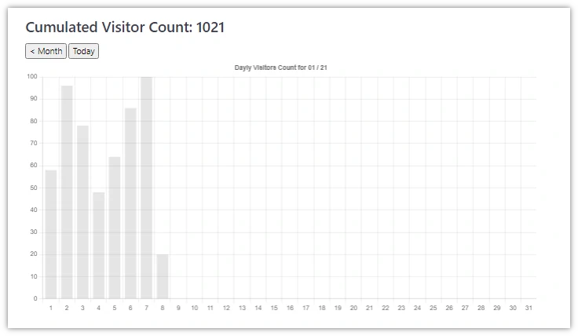

# IPcount Plugin

The **IPcount** Plugin is for [Grav CMS](http://github.com/getgrav/grav). It counts the visitors on your Website, excluding Robots/Scanners etc.
It is inspired by [Grav Plugin Iplocate](https://github.com/Perlkonig/grav-plugin-iplocate)

## Installation

Installing the IPcount plugin can be done in one of two ways. The GPM (Grav Package Manager) installation method enables you to quickly and easily install the plugin with a simple terminal command, while the manual method enables you to do so via a zip file.

### GPM Installation (Preferred, but currently not possible - see Manual Installation)

The simplest way to install this plugin is via the [Grav Package Manager (GPM)](http://learn.getgrav.org/advanced/grav-gpm) through your system's terminal (also called the command line).  From the root of your Grav install type:

    bin/gpm install ipcount

This will install the IPcount plugin into your `/user/plugins` directory within Grav. Its files can be found under `/your/site/grav/user/plugins/ipcount`.

### Manual Installation

To install this plugin, just download the zip version of this repository and unzip it under `/your/site/grav/user/plugins`. Then, rename the folder to `ipcount`. You can find these files on [GitHub](https://github.com/wernerjoss/grav-plugin-ipcount)

You should now have all the plugin files under

    /your/site/grav/user/plugins/ipcount


## Configuration

To override the default configuration, copy `/user/plugins/ipcount.yaml` to your `/user/config/plugins` folder.

```
enabled: true
```

`enabled` is used to enable/disable the plugin. There is no way to selectively enable this plugin. Either it is on or off.

## Data file
Visitor counts are stored in `/user/data/counter/counter.json`.

If you are updating from v1.1.x to 1.2.x, be sure to copy your old count data from `counter.txt` to `counter.json`.
A sample `counter.json` file looks as follows:
```
{
    "count": 232,
    "days": {
        "210101": 58,
        "210102": 96,
        "210103": 78
    }
}
```
So all you have to do is copy the correct number from counter.txt to counter.json :-)

## Available Twig variables
### Using Twig template
To show the cummulative number of visitors on every page, you can add the Twig function `{{ counter() }}` to a suitable template of your theme. E.g. in `/user/themes/quark/templates/default.html.twig`:
```

    {{ page.content|raw }}

    Visitor count: {{ counter() }}

```

### Inline in page content
If you wish to embed the counter inside the content of a page, you can add `{{ counter() }}` anywhere inside the Markdown of your page and add the following to the frontmatter of the page:
```
---
process:
  twig: true
cache_enable: false
---
```

## Chart with daily visitors
To show the visitor count in a bar chart, create a new page using the `visitors.html.twig` template. E.g.  `/user/pages/03.chart/visitors.md`



## Additional Notes:
- As of V 1.3.5, a Utility Script CountRotate.php is added in Folder cron which can be used to keep the Count Data File at a reasonable small size,without losing old Data - see comments in the File for Usage.  
- After Update to V 1.3.6, be sure to delete or replace visitors.html.twig Template in your Theme Folder, as this is now provided by the plugin (this hint can be ignored if you are not using a chart page).  
- From V 1.3.9, the template for a bar chart page can now be selected from the Grav admin page type dropdown, no need to create visitors.md by hand anymore.
